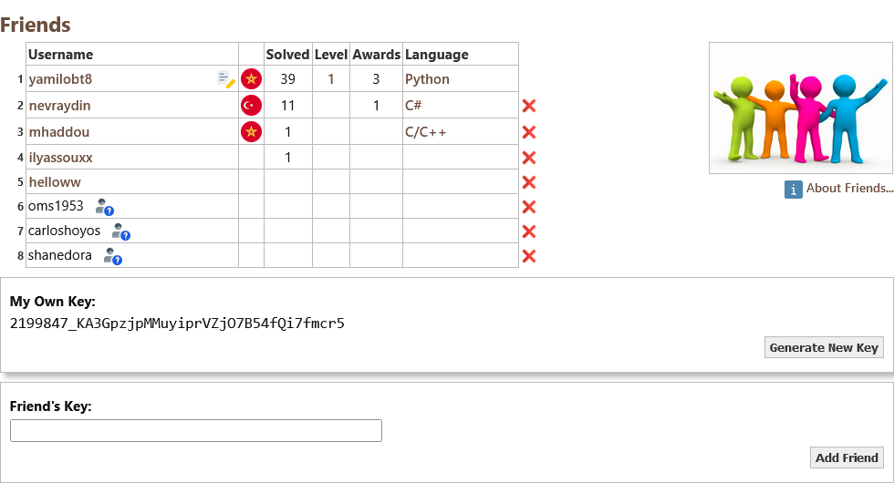

# Project Overview  

## Solving the First 100 Project Euler Problems  

<p align="center">
    
</p>  

  

## Add Me  

<p align="center">
    
</p>  

### **2199847_KA3GpzjpMMuyiprVZjO7B54fQi7fmcr5**  

## Join My Friends List  

<p align="center">
    
</p>  

### Overview  
This repository contains solutions for the first 100 problems of **Project Euler**.  

### Features  
- ✅ **Easy to Understand**  
- ✅ **Clean Code**  
- ✅ **Beginner-Friendly**  

### Technologies Used  
- 🐍 Python  
- 🧠 Problem Solving  
- 🔢 Mathematics  

### Installation  
To run the project locally, follow these steps:  

1. Clone the repository:  
   ```bash
   git clone https://github.com/yamilobt8/Project-Euler.git

2. Run a solution file (after installing the latest Python version): 
   ```bash
   python3 Large_Sum.py