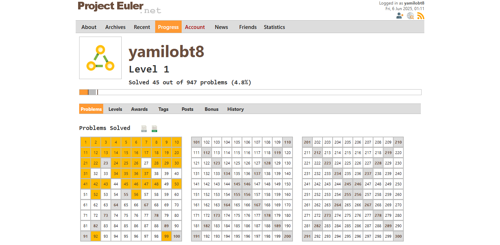

# Project Overview

Working On The 50 First Euler Project Problems

## My Own Euler Project Projress

<p align="center">
    
</p>




### Overview
Solutions Of The First 50 Project Euler Problems

### Features
- **Easy To understand**
- **Clean CODE**
- **Beginner Freindly**

### Technologies Used
- Python
- Problem Solving
- Math

### Installation
To run the project locally, follow these steps:
1. Clone the repository:  
```bash
   git clone https://github.com/growthchasers/Project-Euler.git
```
2. Run The Files(After Installing The latest Python version):  
```bash
    python3 Large_Sum
```
